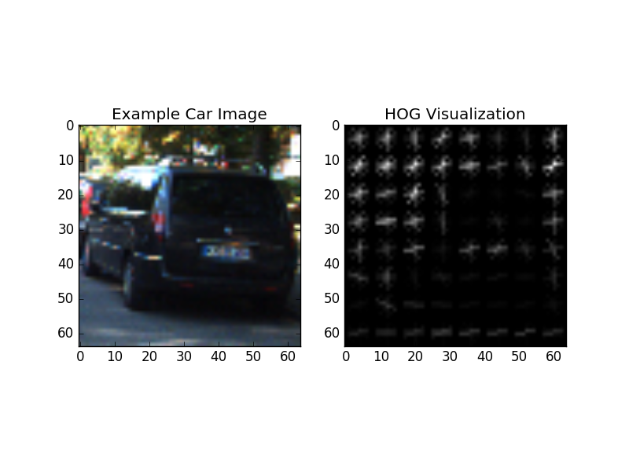
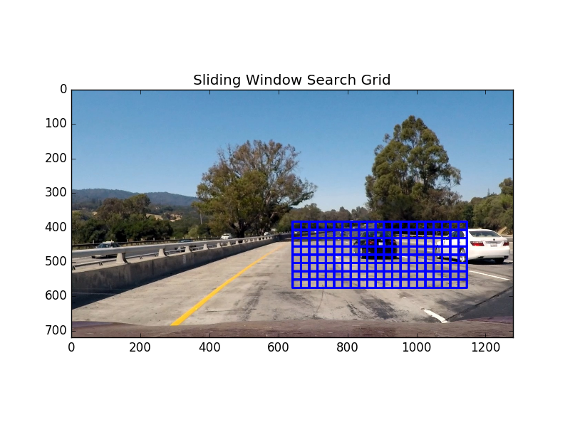
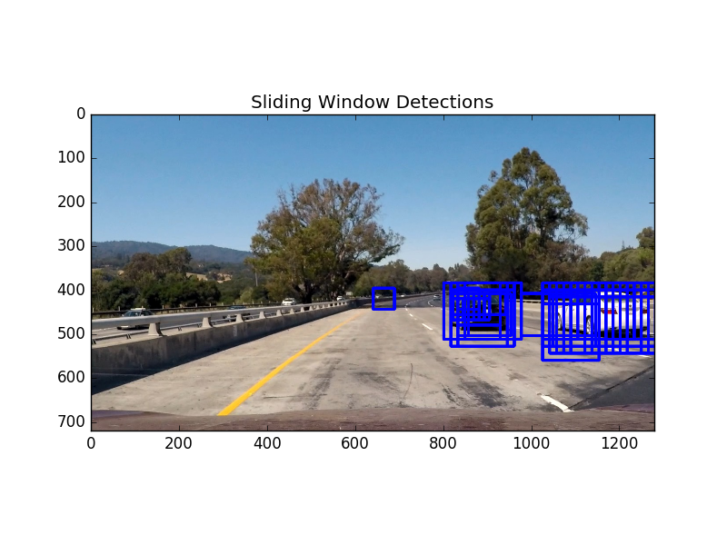
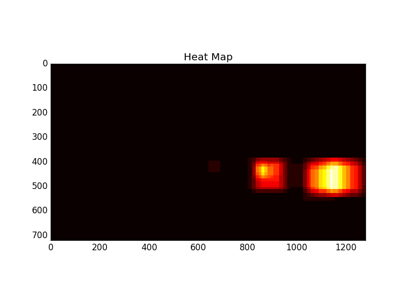
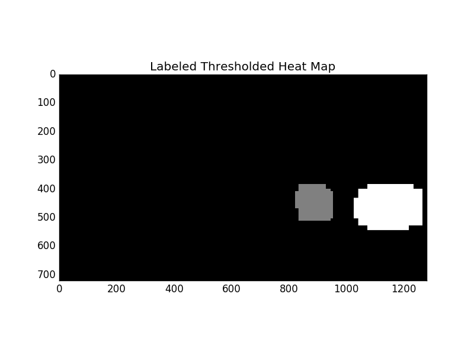
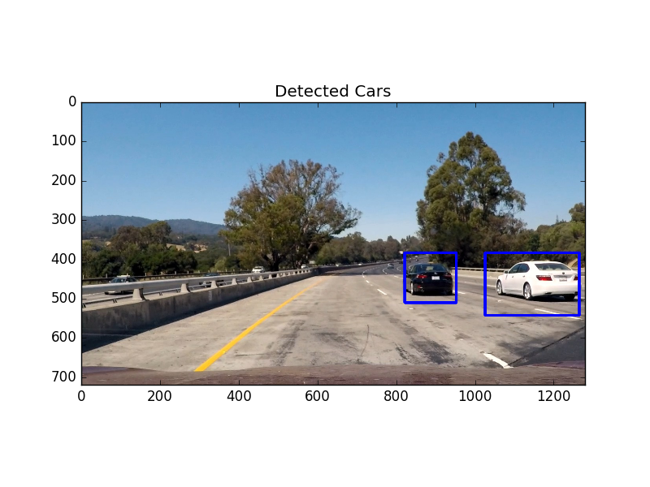

# Vehicle Detection

My work for Udacity's Self-Driving Car Nanodegree, Project 5

## Histogram of Oriented Gradients (HOG)

### Data Exploration

I began this project by exploring the data in the provided project vehicles and non-vehicles datasets. My code for data exploration is found in [code/data_exploration.py](code/data_exploration.py).

My goals for data exploration were:

1. Determine the sizes of sample images
2. Determine how many cars and non-car images there were.

The dataset contains **8792 car images** and **8968 non-car** images, all of which are **64x64 pixels**. This meant that I didn't need to preprocess the images to make them all the same size. Additionally, I didn't find it necessary to adjust the ratio of car to non-car images, since each class represents approximately half of the total image data and I felt that the skew towards non-cars would be negligible.

### HOG Feature Extraction

HOG Feature extraction code is found in [code/feature_extraction.py](code/feature_extraction.py), in the `get_hog_features()` function. This is called on a per color channel basis via `get_hog_features_by_channel()`, which is in turn called as part of overall feature extraction in `extract_features_from_img()`.

I used the following parameters:

* orientations: 9
* pixels per cell: 8
* cells per block: 2

These values were used throughout the lesson material. I continued to use them since I was able to get satisfactory results from them. An example of detected gradients from a sample car image from the dataset is shown below.

Spatial features and RGB color features were used as well. I stuck with the RGB color space due to time constraints preventing further experimentation and because I got satisfactory results without changing it.



### Classifier Training

Given these parameters, I trained a Support Vector Classifier. The classifier was trained in [code/train_svc.py](code/train_svc.py) in the `generate_svc()` function.

Training was done via the following steps:

1. Get all car and not-car image file paths.
2. Extract features for each class.
3. Use a `sklearn.preprocessing.StandardScaler` to normalize feature values. This scaler is saved and used for the video processing pipeline as well.
4. Split features into training and test sets.
5. Train a linear SVC.

I got the following output when training the SVC:

```
58 seconds to extract HOG features...
Using: 9 orientations 8 pixels per cell and 2 cells per block
Feature vector length: 4932
19 seconds to train SVC...
Test Accuracy of SVC =  0.9814
My SVC predicts:  [ 1.  1.  0.  1.  0.  1.  1.  1.  0.  0.]
For these 10 labels:  [ 1.  1.  0.  1.  0.  1.  1.  1.  0.  0.]
0 seconds to seconds to predict 10 labels with SVC
```

I was satisfied with the test accuracy and used this SVC in the video processing pipeline.

## Sliding Window Search

I implemented a sliding window search in [code/sliding_window.py](code/sliding_window.py). In `slide_window()` I use the sliding window implementation presented in class to generate windows to be searched later. An example of the windows returned by this function is shown below:



In this example I used the following parameters:

* x start: 640
* x stop: 1152
* window size: 96 x 96 pixels
* overlap: 75%; note that the boxes look smaller than 96 x 96 pixels due to this overlap.

After generating windows with `slide_window()`, I used `search_windows()` to iterate over the windows, extract features from each window, and make a prediction using the SVC. An example of car detections using this method is shown below. Note the false positives in the center of the road and between the cars:



These functions were tied together in `find_car_windows_via_blind_search()` in [code/process_image.py](code/process_image.py). This function would loop over tuples of `x_start_stop`, `y_start_stop`, `xy_window` size, and `xy_overlap`. The specific values I used were:

```python
window_paramsets = [
    ([640, 1024], [384, 512], (48, 48), (0.75, 0.75)),
    ([640, 1152], [384, 576], (96, 96), (0.75, 0.75)),
    ([704, None], [384, 640], (128, 128), (0.875, 0.875))]
```

I chose these parameters by trial-and-error based on the following ideas:

* Cars shouldn't appear in the sky, so the upper half of the image can be ignored to save time.
* Cars further away should be smaller and closer to the center. Cars closer are larger and can appear at the edges.
* In the specific example of the project video, I can save time by ignoring the left half of the image, since the cars in this video feed only occur in the right half. Given more time and a need to genericize this process, I would extend the search to the left half since the car could be anywhere on the road.

To both reduce the incidence of false positives and to define bounding boxes for individual cars, I used the heat map and `scipy.ndimage.measurements.label()` techniques discussed in the lesson. `process_image.py:find_car_bboxes_from_windows()` is the function used to tie these steps together.

Given overlapping sliding window detections, `process_image.py:add_heat()` is used to generate a heat map. An example is shown below:



Note that the cars appear bright and the false positives appear dim.

After generating the heat map, I applied a threshold to filter out low-confidence detections. I chose a threshold of 3 based on trial-and-error. Note that this value depends on the `windowset_params` described earlier, since a higher resolution search increases the chance that a false positive will have multiple window detections.

After thresholding the heat map via `process_image.py:apply_heatmap_threshold()`, I use `scipy.ndimage.measurements.label()` to label regions that represent cars. An example is shown below:



Finally, these labels were fed to `process_image.py:get_labeled_boxes()` to define the bounding boxes containing cars. A final output example is shown below:



Note that although the cars are detected, the bounding boxes do not hug them perfectly. This is an expected result of using a limited number of discrete window sizes for the sliding window search.

## Video Implementation

My final video output can be found in [project_video_output.mp4](project_video_output.mp4).

With this single-image processing pipeline in place, I then set up a video processing pipeline in [code/process_video.py](code/process_video.py). `process_frame()` is the main function for processing individual video frames.

Since the video is a stream of images, I used several additional techniques:

* Processing every single frame with my pipeline would be excruciatingly slow. To significantly speed up processing, I only process every 10th frame. This is justified by the fact that significant changes in car positions are unlikely to occur between single frames. 10 frames was chosen to optimize detection fidelity and processing speed. On in-between, frames, the previous detection result is used.
* I noticed some false positives that were very slender. I manually filtered these out via `filter_bad_bboxes()`.
* Since adjacent car detections could lead to a wide "merged" detection, I set a width to height threshold of 1.9 for splitting this type of detection into two boxes. This is justified by the idea that single car detections should be fairly square, with wide detections most likely being two cars merged together. I split detections via `split_wide_bboxes()`.
* I kept track of the number of cars seen in the previous detection as well as their centroids. If the current count did not match or if the centroids were too far apart, I would skip the use of that detection for plotting. Note that I would still count it towards history however, so if the next detection agreed, then it would be used. Note that the result is a small delay between a real detection and its rendering in the video.
* One issue with the previous technique was oscillation between the number of detections. To ensure oscillations didn't prevent updates for too long, I only allow for detections to be skipped twice before forcing the next detection to be used.

## Discussion

I discussed many of the issues I encountered in video processing in the previous section. To recap, these issues were:

* Processing speed
* How to handle "merged" detections of two close adjacent cars
* Manipulating and managing history (number of detections; positions of detections) to ensure high-confidence detections.

Related to the issue of processing speed is the issue of resolution. I could have produced tighter bounding boxes by adding more search window sizes and increasing overlap, but this would slow down the pipeline even more. In my processed video, one noticeable result of the chosen resolutions is at second 36 where the detection boxes skew towards the right of the video, past the white car. The video correctly detects that there are two cars in approximately that region, but the actual bounding boxes err for that second.

To hasten video processing, I only examined the right side of the video. This pipeline as-is would fail if the car were in the middle of the highway and had to deal with cars on either side.

High traffic could also potentially cause issues. As described above, I separated adjacent detections into two based on the aspect radio of the bounding box. However, this method may fail in real-world driving since several cars in a row could be adjacent and the exact count may not be obvious.
